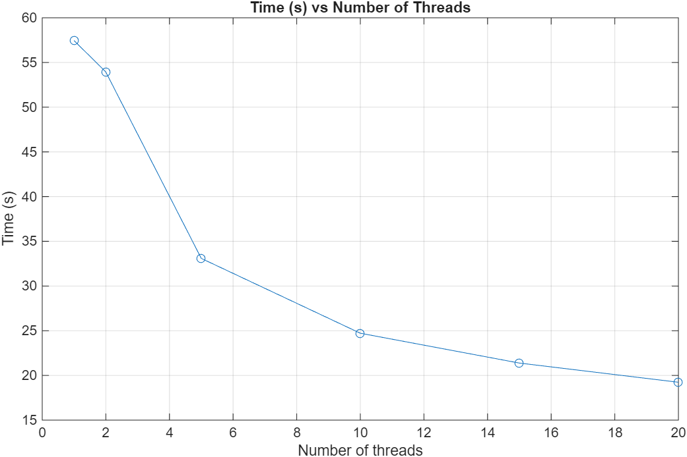
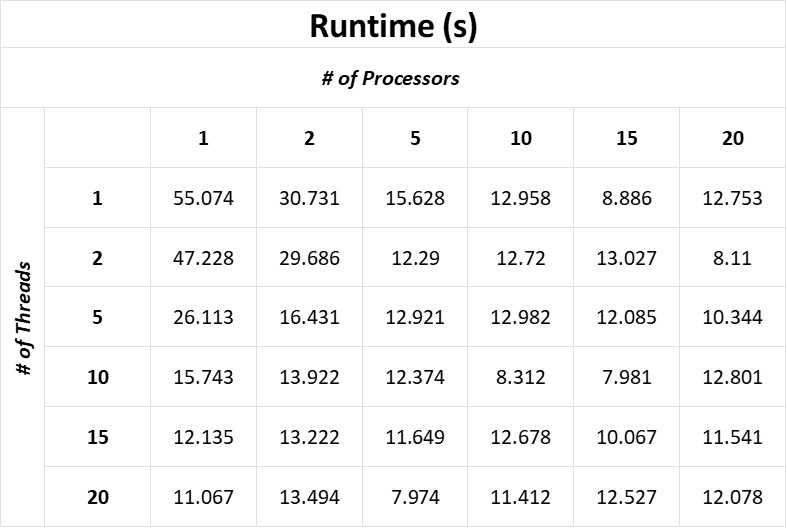

# System Programming Lab 11 Multiprocessing

## Report - Lab 11

### Implementation

The mandelmovie.c file in the repository contains the main program for Lab 11. This program takes in a number of processors to use via command line flags.

```
$ ./mandelmovie -p <num processors (1-50)>
```
The program then generates a set of 50 images using either the maximum number of processors the user specified, or the maximum number of processors on the user's computer -- whichever is smaller.

The program runs a ```for``` loop, forking at the beginning of each loop -- unless the program is already using the maximum number of processors. In each run of the loop, if there is an available processor, the program forks, sending the child to <ins>replace it's process with a new process</ins> (mandel.c). 

Each iteration through the loop slightly alters the scale passed into mandel.c via the flag '-s' and alters the output file name to ```mandel(i).jpg``` where ```(i)``` is the count of the for loop (0 - 49).

### Experiment

To test how the number of processors a program uses affects program runtime, mandelmovie.c was executed and timed with a variable number of processors.

```
$ time ./mandelmovie -p <num processors>
```

#### Results


The timing experiment showed that utilizing an extra 2-4 processors significantly reduces the origional runtime compared to a single processor. However, there is a diminishing return on the use of processors. The more processors we take up, the faster our program runs. However, the more processors the program uses, the slower the overall system runs.

## Report - Lab 12

### Implementation
The only modification to ```mandelmovie.c``` in Lab 12 was the addition of the ```-t <num threads (1-20)>``` optional flag. 

```mandel.c``` was modified to add another optional flag ```-t <num threads (1-20)>```. From there, ```mandel.c``` calls the same compute_image function in Lab 11. However, this function now takes in a number of threads.

```compute_image``` makes an array of thread IDs and an array of data to pass to each thread. Each thread gets a structure as an argument. This is defined as ```typedef struct {...}thread_data;```. The struct contains all the information normally passed into the ```compute_image``` function.

From there, the new ```compute_image``` function calls ```compute_image_thread```. This is the same function as ```compute_image``` in Lab 11, only it allows the programmer to specify the number of rows to compute.

The Lab 12 modified ```compute_image``` separates the image into a number of regions equal to the number of threads. Each thread gets one region to compute specified by the start_row and end_row values set.

```mandelmovie.c``` performs exactly the same as in Lab 11, only it can now pass a number of threads to be used to ```mandel.c```.

### Thread Runtime Experiment
To test the affect of multithreading on program performance, ```mandelmovie.c``` was run with a variable number of threads and timed.

#### Results


The Thread Runtime Experiment yielded the graph above. The graph suggests that 5-10 threads yield the most benefit before there is a diminishing return on runtime performance.

### \# of Threads vs \# of Processors Experiement
To compare which technique is more impactful on runtime performance, we varied the number of processors and the number of threads and created the table below.

#### Results


##### Impact
The table shows that multiprocessing was more impactful in runtime performance. This is likely due to multiprocessing being true parallelism whereas multithreading is merely concurrency, meaning we are designing to run in parallel, but it is not guaranteed.

While multithreading did significantly reduce runtime performance, it required ~5 threads to reduce to a similar performance to that of 2 processors. 

When comparing # of Processors to # of Threads one-to-one, processors are clearly more impactful due to their true parallelism. However, it is worth noting that creating each process is more difficult, requires IPC, and takes more time than multithreading.

##### Sweet Spot
Minimal runtime was achieved with 5 processors and 20 threads. However, runtime performance seemed to plateau around 12-13 second. Adding more processors/threads beyond that runtime did not significantly impact performance. 

Looking in the 12-13 second plateau range to optimize resource usage, either about 2 processors and 20 threads seemed optimal, or 5 processors and 2 threads was marginally better by only ~1 second.