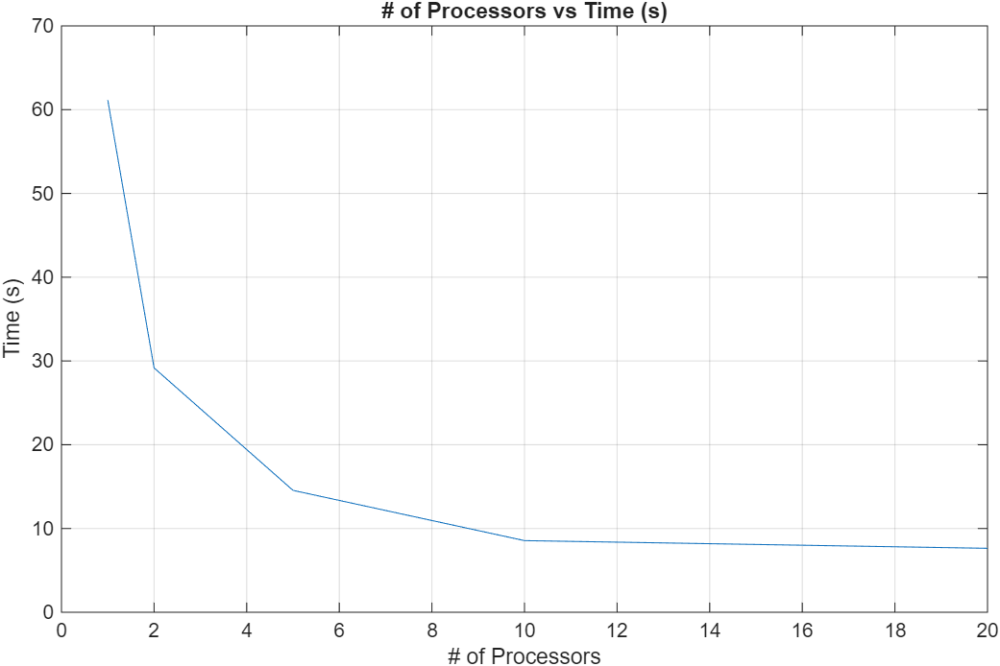

# System Programming Lab 11 Multiprocessing

## Report

### Implementation

The mandelmovie.c file in the repository contains the main program for Lab 11. This program takes in a number of processors to use via command line flags.

```
$ ./mandelmovie -p <num processors (1-50)>
```
The program then generates a set of 50 images using either the maximum number of processors the user specified, or the maximum number of processors on the user's computer -- whichever is smaller.

The program runs a ```for``` loop, forking at the beginning of each loop -- unless the program is already using the maximum number of processors. In each run of the loop, if there is an available processor, the program forks, sending the child to <ins>replace it's process with a new process</ins> (mandel.c). 

Each iteration through the loop slightly alters the scale passed into mandel.c via the flag '-s' and alters the output file name to ```mandel(i).jpg``` where ```(i)``` is the count of the for loop (0 - 49).

### Experiment

To test how the number of processors a program uses affects program runtime, mandelmovie.c was executed and timed with a variable number of processors.

```
$ time ./mandelmovie -p <num processors>
```

#### Results



The timing experiment showed that utilizing an extra 2-4 processors significantly reduces the origional runtime compared to a single processor. However, there is a diminishing return on the use of processors. The more processors we take up, the faster our program runs. However, the more processors the program uses, the slower the overall system runs.